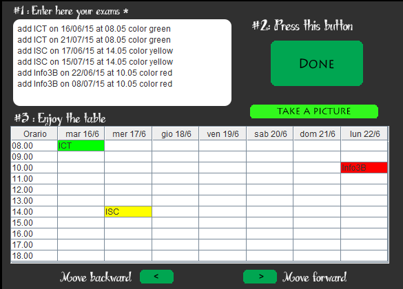

# ExamTable
A small desktop application to plan an exam session.

ExamTable is a university progect we developed for the course 'Languages and compilers' and uses ANTLR to define a SQL-like language in
order to define the specifications of the table that will be subsequently created. This approach is much more user friendy and can be adopted
instead of an XML-style base codification.
UI and user input are maneged by a Java basis ( about 500 LOC ).
The project has been developed using Java Netbeans IDE 8.0.2.

The application itself is self-explanatory once run and contains a .jpg screenshot inside the main folder.
It's highly suggested to keep a .txt file containing all the exam definitions in order to copy-paste every exam and defining the table
much quickly than re-writing all exams from scratch.
